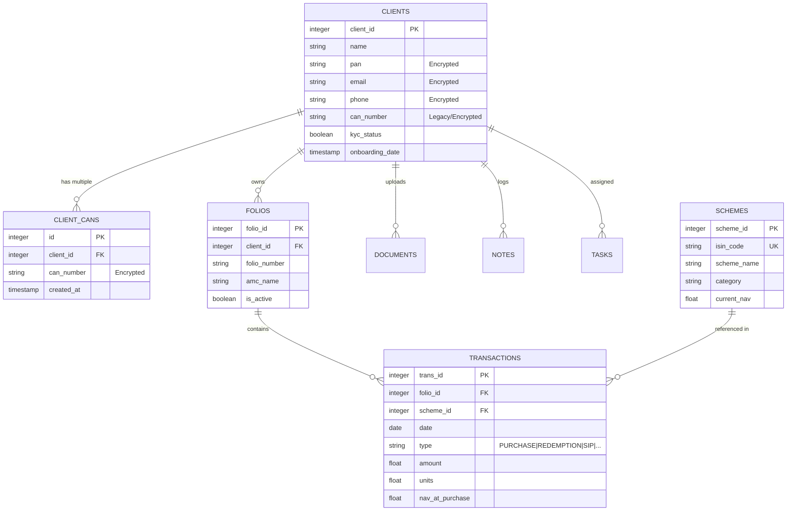

# Open-MFD CRM Developer Guide

Welcome to the development team! This guide will help you understand the architecture, project structure, and development workflow of Open-MFD CRM.

## 🏗️ Architecture Overview

Open-MFD is built as a lightweight, portable Python application using the following core components:

- **Frontend**: [Streamlit](https://streamlit.io/) handles the UI and state management.
- **Database**: [SQLite](https://www.sqlite.org/) is used for local data storage.
- **Encryption**: [Cryptography (Fernet)](https://cryptography.io/en/latest/fernet/) secures sensitive client data.
- **Logic**: Custom Python modules in `src/modules/` handle calculations and database interactions.

## 📁 Project Structure

```text
open_mfd_crm/
├── data/               # Local data storage (DB, documents)
├── src/
│   ├── modules/        # Core business logic & DB interface
│   │   ├── database.py     # Main DB wrapper & Encryption logic
│   │   └── calculations.py # Financial/Portfolio math
│   ├── ui/             # Streamlit UI components
│   │   ├── dashboard.py    # Main landing page logic
│   │   └── components.py   # Reusable UI fragments
│   └── app.py          # Application entry point
├── build_scripts/      # Scripts for creating portable builds
├── .env                # Environment configuration (Keys, Paths)
└── requirements.txt    # Python dependencies
```

## 🛠️ Development Setup

### 1. Prerequisites
- Python 3.9 or higher.
- `pip` (Python package manager).

### 2. Installation
Clone the repository and install the dependencies:
```bash
pip install -r requirements.txt
```

### 3. Environment Configuration
Create a `.env` file in the root directory (the app will auto-generate one if missing):
```text
DB_PATH=open_mfd.db
FERNET_KEY=your_base64_encryption_key
```

### 4. Running the App
```bash
python src/app.py
```

## 🔐 Security & Encryption

Open-MFD uses **Field-Level Encryption** for sensitive data:
- **Database**: Fields like PAN, Email, Phone, and CAN are encrypted before being stored in SQLite.
- **Documents**: File contents are encrypted using the same `FERNET_KEY` before being saved to the `data/documents/` folder.

**Important**: Never commit your `.env` file or hardcode keys.

## 🗃️ Database Schema Design

Open-MFD uses a relational schema designed to maintain clean separation between client profiles, their investment structures (folios), and actual transaction history.

### Entity Relationship Diagram



### Table Definitions & Logic

1.  **`clients`**: The central entity. Sensitive fields (PAN, Email, Phone, CAN) are encrypted at rest using Fernet symmetric encryption. One-to-many relationships exist for almost all other tables.
2.  **`client_cans`**: Supports the "Multiple CAN" requirement. All CAN numbers added here are also encrypted.
3.  **`folios`**: Represents a unique account number at an AMC. A client can have multiple folios.
4.  **`schemes`**: A master list of Mutual Fund schemes. Transactions reference these to avoid data duplication and ensure consistent naming.
5.  **`transactions`**: The ledger of all financial movements. It links a specific `scheme` to a specific `folio`.
6.  **`documents`**: Stores metadata for files. The `file_path` points to the `data/documents/` directory where the **encrypted binary content** is stored.
7.  **`notes` & `tasks`**: CRM interaction data. `notes` tracks meeting logs while `tasks` manages the workflow for signatures and reviews.

### 🔐 Multi-Layer Encryption Strategy

-   **Database Layer**: Sensitive strings are converted to encrypted tokens before `INSERT/UPDATE`.
-   **File Layer**: Binary data (images, PDFs) is encrypted using the same key before writing to the filesystem.
-   **Key Management**: The `FERNET_KEY` in `.env` is the master key. If this key is lost, data recovery is impossible without a backup of the key.

## 📦 Building for Distribution

We use `PyInstaller` (via scripts in `build_scripts/`) to create "no-install" portable versions for Windows and Linux.
- To build for Windows: `python build_scripts/build_windows.py`
- This bundles the Python interpreter, dependencies, and the app into a single distributable ZIP.

## 🧪 Testing

We use separate verification scripts for testing core modules:
- `test_vault.py`: Verifies encryption and document storage.
- `test_multiple_cans.py`: Verifies the multi-CAN logic and migration.

Always run these tests before submitting a Pull Request.
