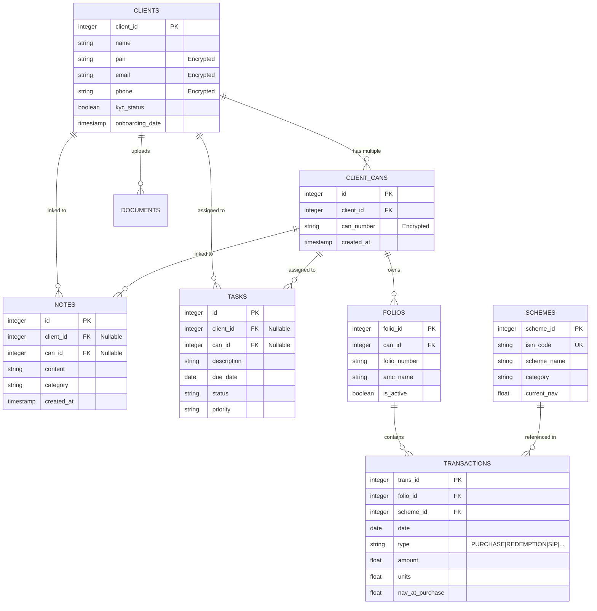

# Open-MFD CRM Developer Guide

Welcome to the development team! This guide will help you understand the architecture, project structure, and development workflow of Open-MFD CRM.

## 🏗️ Architecture Overview

Open-MFD is built as a lightweight, portable Python application using the following core components:

- **Frontend**: [Streamlit](https://streamlit.io/) handles the UI and state management.
- **Database**: [SQLite](https://www.sqlite.org/) is used for local data storage.
- **Encryption**: [Cryptography (Fernet)](https://cryptography.io/en/latest/fernet/) secures sensitive client data.
- **Logic**: Custom Python modules in `src/modules/` handle calculations and database interactions.

## 📁 Project Structure

```text
open_mfd_crm/
├── data/               # Local data storage (DB, backups, documents)
├── src/
│   ├── modules/        # Core business logic & specialized DB modules
│   │   ├── db/             # Experimental: Domain-specific repositories
│   │   │   ├── clients.py      # Client & CAN CRUD
│   │   │   ├── transactions.py # Trade logging & portfolio fetches
│   │   │   ├── encryption.py   # Fernet encryption mixin
│   │   │   └── schema.py       # DDL and Migrations
│   │   ├── database.py     # Backward-compatible Facade (entry point)
│   │   ├── calculations.py # Pure financial/portfolio math
│   │   └── constants.py    # Shared Enums (TransactionType, Status, etc.)
│   ├── ui/             # Modular Streamlit components
│   │   ├── dashboard.py    # Main landing page orchestration
│   │   ├── client_form.py  # Onboarding UI
│   │   ├── transaction_form.py # Trade entry UI
│   │   └── components.py   # Re-export shim for legacy compatibility
│   └── app.py          # Application entry point
├── .env                # Environment configuration
└── requirements.txt    # Python dependencies
```

## 🛠️ Development Setup

### 1. Prerequisites
- Python 3.9 or higher.
- `pip` (Python package manager).

### 2. Installation
Clone the repository and install the dependencies:
```bash
pip install -r requirements.txt
```

### 3. Environment Configuration
Create a `.env` file in the root directory (the app will auto-generate one if missing):
```text
DB_PATH=open_mfd.db
FERNET_KEY=your_base64_encryption_key
```

### 4. Running the App
```bash
python src/app.py
```

## 🔐 Security & Encryption

Open-MFD uses **Field-Level Encryption** centered in the `EncryptionMixin`:
- **Database Layer**: Repositories like `ClientRepository` use `_encrypt()` before `INSERT`.
- **File Layer**: `DocumentRepository` encrypts binary content before writing to `data/documents/`.
- **Fallback**: The `_decrypt()` method includes logic to return plain text if decryption fails, supporting legacy data gracefully.

**Important**: Never commit your `.env` file or hardcode keys.

## 🏛️ Core Design Patterns

### 1. Repository Pattern
Instead of a single SQL file, logic is split by domain (clients, transactions, tasks, etc.) inside `src/modules/db/`. Each repository inherits from `BaseRepository` for connection handling.

### 2. Facade Pattern
`src/modules/database.py` acts as a single entry point (Facade). It composes all specialized repositories, allowing legacy code to call `db.add_client()` without knowing it's delegated to `db.clients.add_client()`.

### 3. Pure Math Logic
`src/modules/calculations.py` contains **no SQL**. It accepts DataFrames from the `TransactionRepository` and returns mathematical results, making it easy to unit test.

## 🗃️ Database Schema Design

Open-MFD uses a relational schema designed to maintain clean separation between client profiles, their investment structures (folios), and actual transaction history.

### Entity Relationship Diagram



### Table Definitions & Logic

1.  **`clients`**: The central entity. Sensitive fields (PAN, Email, Phone) are encrypted at rest. All CAN numbers are managed via the `client_cans` table.
2.  **`client_cans`**: Holds one or more CAN numbers per client (all encrypted). Each CAN can independently own folios.
3.  **`folios`**: Belongs to a **specific CAN** (`can_id` FK → `client_cans.id`), not directly to a client. This reflects the real-world MFU model where a folio is registered under a CAN.
4.  **`schemes`**: A master list of Mutual Fund schemes. Transactions reference these to avoid data duplication and ensure consistent naming.
5.  **`transactions`**: The ledger of all financial movements. It links a specific `scheme` to a specific `folio`.
6.  **`documents`**: Stores metadata for files.
7.  **`notes` & `tasks`**: CRM interaction data. 
    - **Multi-Linkage**: Both tables include nullable `client_id` and `can_id` foreign keys.
    - **Constraint**: A SQL `CHECK` constraint ensures that **at least one** of these two IDs must be non-null, preventing "orphaned" records while allowing flexibility (e.g., a note relevant to a specific CAN vs. a general client-level note).

### 🔐 Multi-Layer Encryption Strategy

-   **Database Layer**: Sensitive strings are converted to encrypted tokens before `INSERT/UPDATE`.
-   **File Layer**: Binary data (images, PDFs) is encrypted using the same key before writing to the filesystem.
-   **Key Management**: The `FERNET_KEY` in `.env` is the master key. If this key is lost, data recovery is impossible without a backup of the key.

## 📦 Building for Distribution

We use `PyInstaller` (via scripts in `build_scripts/`) to create "no-install" portable versions for Windows and Linux.
- To build for Windows: `python build_scripts/build_windows.py`
- This bundles the Python interpreter, dependencies, and the app into a single distributable ZIP.

## 🧪 Testing

We use separate verification scripts for testing core modules:
- `test_db.py`: Verifies the Repository/Facade integrity and backward compatibility.
- `test_calc.py`: Verifies financial calculations using mock DataFrames.
- `test_scalability.py`: Stress tests the DB layer with thousands of records.

Always run these tests before submitting a Pull Request.
