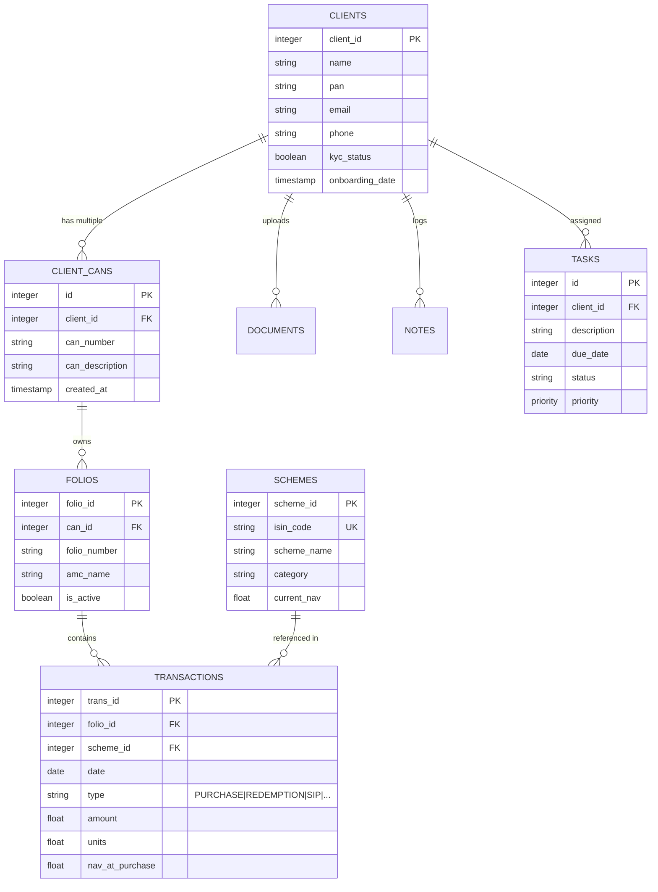

# Open-MFD CRM Developer Guide

Welcome to the development team! This guide will help you understand the architecture, project structure, and development workflow of Open-MFD CRM.

## 🏗️ Architecture Overview

Open-MFD is built as a lightweight, portable Python application using the following core components:

- **Frontend**: [Streamlit](https://streamlit.io/) handles the UI and state management.
- **Database**: [SQLite](https://www.sqlite.org/) is used for local data storage.
- **Logic**: Custom Python modules in `src/modules/` handle calculations and database interactions.

## 📁 Project Structure

```text
open_mfd_crm/
├── data/               # Local data storage (DB, backups, documents)
├── docs/               # MkDocs source files (index, guides)
├── src/
│   ├── app.py          # Application entry point
│   ├── assets/         # UI assets (images, logos)
│   ├── modules/
│   │   ├── db/             # Data access layer (Repositories)
│   │   │   ├── clients.py      # Client & CAN CRUD
│   │   │   ├── connection.py   # DB connection pooling
│   │   │   ├── database.py     # Main Repository class
│   │   │   ├── documents.py    # Document metadata logic
│   │   │   ├── folios.py       # Folio-specific CRUD
│   │   │   ├── notes.py        # Meeting notes storage
│   │   │   ├── schema.py       # SQL DDL and migrations
│   │   │   ├── tasks.py        # CRM task engine
│   │   │   └── transactions.py # Trade entry & portfolio pulls
│   │   ├── bulk_import.py      # Multi-format onboarding logic
│   │   ├── calculations.py     # Pure financial math (XIRR, Gains)
│   │   ├── constants.py        # Shared enums and types
│   │   ├── database.py         # Legacy Facade (Shim)
│   │   └── mfu_api.py          # MFU API integration (Development)
│   └── ui/             # Streamlit view components
│       ├── can_management.py   # CAN association UI
│       ├── client_form.py      # Onboarding forms
│       ├── components.py       # Core UI widgets
│       ├── dashboard.py        # Landing & Analytics view
│       ├── documents_view.py   # Document management UI
│       ├── notes_view.py       # Meeting interaction log
│       ├── tasks_view.py       # Global & Client task tables
│       └── transaction_form.py # Trade entry forms
├── .env                # Environment configuration
├── mkdocs.yml          # Site configuration
└── requirements.txt    # Python dependencies
```

## 🛠️ Development Setup

### 1. Prerequisites
- Python 3.9 or higher.
- `pip` (Python package manager).

### 2. Installation
Clone the repository and install the dependencies:
```bash
pip install -r requirements.txt
```

### 3. Environment Configuration
Create a `.env` file in the root directory (the app will auto-generate one if missing):
```text
DB_PATH=open_mfd.db
```

### 4. Running the App
```bash
python src/app.py
```

## 🏛️ Core Design Patterns

### 1. Repository Pattern
Instead of a single SQL file, logic is split by domain (clients, transactions, tasks, etc.) inside `src/modules/db/`. Each repository inherits from `BaseRepository` for connection handling.

### 2. Facade Pattern
`src/modules/database.py` acts as a single entry point (Facade). It composes all specialized repositories, allowing legacy code to call `db.add_client()` or `db.delete_client()` without knowing it's delegated to the specialized repositories.

### 3. Pure Math Logic
`src/modules/calculations.py` contains **no SQL**. It accepts DataFrames from the `TransactionRepository` and returns mathematical results, making it easy to unit test.

## 🗃️ Database Schema Design

Open-MFD uses a relational schema designed to maintain clean separation between client profiles, their investment structures (folios), and actual transaction history.

### Entity Relationship Diagram


```mermaid
erDiagram
    CLIENTS ||--o{ CLIENT_CANS : "has multiple"
    CLIENTS ||--o{ DOCUMENTS : "uploads"
    CLIENTS ||--o{ NOTES : "logs"
    CLIENTS ||--o{ TASKS : "assigned"
    CLIENT_CANS ||--o{ FOLIOS : "owns"
    FOLIOS ||--o{ TRANSACTIONS : "contains"
    SCHEMES ||--o{ TRANSACTIONS : "referenced in"

    CLIENTS {
        integer client_id PK
        string name
        string pan
        string email
        string phone
        boolean kyc_status
        timestamp onboarding_date
    }

    CLIENT_CANS {
        integer id PK
        integer client_id FK
        string can_number
        string can_description
        timestamp created_at
    }

    FOLIOS {
        integer folio_id PK
        integer can_id FK
        string folio_number
        string amc_name
        boolean is_active
    }

    TRANSACTIONS {
        integer trans_id PK
        integer folio_id FK
        integer scheme_id FK
        date date
        string type "PURCHASE|REDEMPTION|SIP|..."
        float amount
        float units
        float nav_at_purchase
    }

    SCHEMES {
        integer scheme_id PK
        string isin_code UK
        string scheme_name
        string category
        float current_nav
    }

    TASKS {
        integer id PK
        integer client_id FK
        string description
        date due_date
        string status
        priority priority
    }
```

### Table Definitions & Logic

1.  **`clients`**: The central entity. All CAN numbers are managed via the `client_cans` table.
2.  **`client_cans`**: Stores multiple CANs per client. Includes a `can_description` for labeling. Each CAN can independently own folios.
3.  **`folios`**: Belongs to a **specific CAN** (`can_id` FK → `client_cans.id`), not directly to a client. This reflects the real-world MFU model where a folio is registered under a CAN.
4.  **`schemes`**: A master list of Mutual Fund schemes. Transactions reference these to avoid data duplication and ensure consistent naming.
5.  **`transactions`**: The ledger of all financial movements. It links a specific `scheme` to a specific `folio`.
6.  **`documents`**: Stores metadata for files.
7.  **`notes` & `tasks`**: CRM interaction data. `notes` tracks meeting logs while `tasks` manages the workflow for signatures and reviews.

## 📦 Building for Distribution

We use `PyInstaller` (via scripts in `build_scripts/`) to create "no-install" portable versions for Windows and Linux.
- To build for Windows: `python build_scripts/build_windows.py`
- This bundles the Python interpreter, dependencies, and the app into a single distributable ZIP.

## 🧪 Testing

We use separate verification scripts for testing core modules:
- `test_db.py`: Verifies the Repository/Facade integrity and backward compatibility.
- `test_calc.py`: Verifies financial calculations using mock DataFrames.
- `test_scalability.py`: Stress tests the DB layer with thousands of records.
- `test_delete_logic.py`: (Internal/Temporary) Verifies cascaded deletion of client data.

Always run these tests before submitting a Pull Request.
